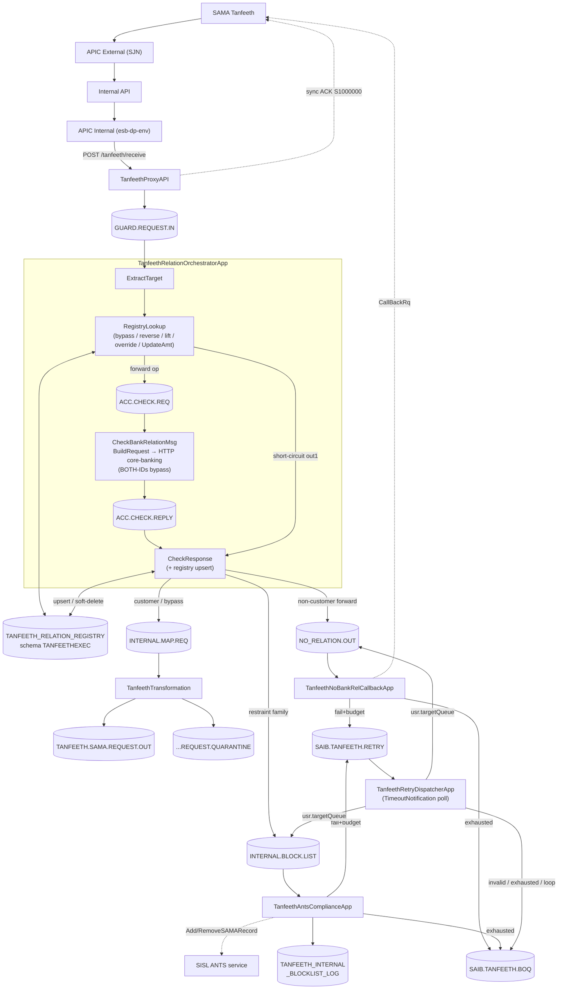

# TanfeethServiceInterceptor — Design Document

**System:** SAMA Tanfeeth Financial Interceptor
**Platform:** IBM Integration Bus (IIB 10) / App Connect Enterprise (ACE 12)
**Date:** 2026-06-12 (reconciled against source)
**Status:** Source-of-truth — reconciled line-by-line with `Interceptor/` codebase

---

## Table of Contents

1. [High-Level Design (Updated)](#high-level-design-updated)
   - 1.1 System Context
   - 1.2 Architecture Overview
   - 1.3 Component Summary
   - 1.4 End-to-End Flow Diagram
   - 1.5 MQ Queue Topology
   - 1.6 Database Components
   - 1.7 Error & Exception Strategy
   - 1.8 Logging Strategy
2. [Low-Level Design (Updated)](#low-level-design-updated)
   - 2.1 TanfeethProxyAPI
   - 2.2 TanfeethRelationOrchestratorApp
   - 2.3 TanfeethTransformation
   - 2.4 TanfeethNoBankRelCallbackApp
   - 2.5 TanfeethAntsComplianceApp
   - 2.6 TanfeethRetryDispatcherApp
   - 2.7 Shared Libraries
3. [Reconciliation Changelog](#reconciliation-changelog)

---

## High-Level Design (Updated)

### 1.1 System Context

The TanfeethServiceInterceptor mediates between the **Saudi Central Bank (SAMA) Tanfeeth system** and **SAIB internal systems**. SAMA initiates financial requests (inquiry, blocking, garnishment, transfer, lift, amount update, etc.) over HTTPS. The request traverses a **three-stage gateway chain** before reaching the IIB/ACE pipeline:

```
SAMA ─▶ APIC External (SJN zone) ─▶ Internal API ─▶ APIC Internal (esb-dp-<env>) ─▶ TanfeethProxyAPI
```

1. **APIC External (SJN):** DMZ/SJN-zone gateway — TLS termination, certificate/IP validation, rate limiting; routes inward.
2. **Internal API:** the internal API tier that fronts the ESB; bridges the SJN edge to the internal APIC catalogue.
3. **APIC Internal (esb-dp):** internal APIC catalogue (`esb-dp-<env>`, e.g. `esb-dp-uat`) — subscription/client-ID enforcement, security policy; invokes `POST /tanfeeth/receive` on the IIB HTTPS listener.

The interceptor:

1. Acknowledges SAMA synchronously (`S1000000` ACK).
2. Classifies the target as **bank customer** or **non-customer** — via a registry cache, configurable bypass rules, or a live core-banking HTTP call.
3. **Customer path:** forwards the original SAMA SOAP to the existing ("old") Tanfeeth mapping service.
4. **Non-customer path:** auto-responds to SAMA via an asynchronous callback (offloading traffic from the main Tanfeeth) and, for restraint operations, maintains an internal ANTS/SISL compliance block-list.

The interceptor persists classification decisions in a **relation registry database** so reversals, lifts, overrides, and amount-updates of prior messages short-circuit without re-invoking the bank-relation service.

### 1.2 Architecture Overview

The IIB/ACE estate comprises **six applications** and **five shared libraries** (`CommonLib`, `TanfeethExecLib`, `TanfeethICSLib`, `TanfeethInterceptorCommonLib`, `TanfeethInterceptorSamaLib`), connected by IBM MQ queues and two database tables.

```
SAMA ─▶ APIC External (SJN) ─▶ Internal API ─▶ APIC Internal (esb-dp-<env>) ──POST /tanfeeth/receive──▶

┌─────────────────────────── IIB / ACE ───────────────────────────────────────┐
│                                                                              │
│ TanfeethProxyAPI ──ACK──▶ SAMA                                               │
│        │ GUARD.REQUEST.IN                                                    │
│        ▼                                                                     │
│ TanfeethRelationOrchestratorApp ◀──registry DB──▶ TANFEETH_RELATION_REGISTRY │
│   │ ExtractTarget → RegistryLookup → [bank check via ACC.CHECK.REQ/REPLY]    │
│   │                                   └─ CheckBankRelationMsg → HTTP core    │
│   ├─ customer / bypass ──▶ INTERNAL.MAP.REQ ──▶ TanfeethTransformation ──▶ … │
│   ├─ non-customer ───────▶ NO_RELATION.OUT  ──▶ TanfeethNoBankRelCallbackApp │
│   └─ restraint fan-out ──▶ INTERNAL.BLOCK.LIST ─▶ TanfeethAntsComplianceApp  │
│                                                     │ audit DB               │
│                                                     ▼                        │
│                                       TANFEETH_INTERNAL_BLOCKLIST_LOG        │
│                                                                              │
│ Failures of either HTTP caller → SAIB.TANFEETH.RETRY ─▶                      │
│ TanfeethRetryDispatcherApp (timer-driven) ─▶ usr.targetQueue | SAIB.TANFEETH.BOQ │
└──────────────────────────────────────────────────────────────────────────────┘
```

### 1.3 Component Summary

| # | Component | Type | Role | Input | Output |
|---|---|---|---|---|---|
| 1 | **APIC External (SJN)** | API Gateway (DMZ/SJN) | TLS termination, cert/IP validation, allowlist, rate limiting | HTTPS from SAMA | HTTPS to Internal API |
| 2 | **Internal API** | Internal API tier | Bridges SJN edge to internal APIC catalogue | HTTPS from EXT APIC | HTTPS to INT APIC |
| 3 | **APIC Internal (esb-dp)** | API Gateway (`esb-dp-<env>`) | Subscription, client-ID, security policy; invoke routing | HTTPS from Internal API | HTTPS to IIB |
| 4 | **TanfeethProxyAPI** | REST + MQ | HTTP gateway, header extraction, sync SOAP ACK | HTTPS POST | MQ + ACK |
| 5 | **TanfeethRelationOrchestratorApp** | MQ + DB + HTTP | Classification engine: registry short-circuits, per-op bypass, bank-relation request-reply, routing fan-out, registry persistence | MQ (XMLNSC) | MQ ×3 destinations |
| 6 | **TanfeethTransformation** | MQ | SAMA→SAIB canonical transformer (4-branch dispatch) | MQ (XMLNSC) | MQ |
| 7 | **TanfeethNoBankRelCallbackApp** | MQ + HTTP | Non-customer SAMA callback (HTTPS POST, retry via shared queue) | MQ (+MQRFH2) | HTTPS / MQ RETRY / MQ BOQ |
| 8 | **TanfeethAntsComplianceApp** | MQ + HTTP + DB | ANTS/SISL block-list maintenance (AddSAMARecord / RemoveSAMARecord) + audit log | MQ (+MQRFH2) | HTTPS / MQ RETRY / MQ BOQ |
| 9 | **TanfeethRetryDispatcherApp** | Timer + MQ | Generic retry/BOQ dispatcher (replaces external cron) | SAIB.TANFEETH.RETRY | `usr.targetQueue` / BOQ |
| 10 | **TANFEETH_RELATION_REGISTRY** | DB table (MSSQL/DB2, schema `TANFEETHEXEC`) | Decision cache: soft-delete history, one active row per LOOKUP_KEY | — | — |
| 11 | **TANFEETH_INTERNAL_BLOCKLIST_LOG** | DB table | ANTS ADD/REMOVE audit trail | — | — |

### 1.4 End-to-End Flow Diagram



### 1.5 MQ Queue Topology

```
── Tier 1: Inter-app pipeline ─────────────────────────────────────────────
SAIB.TANFEETH.GUARD.REQUEST.IN        ProxyAPI → Orchestrator
SAIB.TANFEETH.INTERNAL.MAP.REQ        Orchestrator → Transformation (old Tanfeeth)
SAIB.TANFEETH.NO_RELATION.OUT         Orchestrator → NoBankRelCallback
SAIB.TANFEETH.INTERNAL.BLOCK.LIST     Orchestrator → AntsCompliance (restraint fan-out)

── Tier 2: Bank-relation request-reply (Orchestrator internal) ───────────
SAIB.TANFEETH.ACC.CHECK.REQ           Relation check request (JSON)
SAIB.TANFEETH.ACC.CHECK.REPLY         Relation check reply (60 s, CorrelID match)

── Tier 3: Shared retry / BOQ (single pair for ALL HTTP-calling apps) ────
SAIB.TANFEETH.RETRY                   Producers: Callback + AntsCompliance.
                                      Consumer: TanfeethRetryDispatcherApp.
SAIB.TANFEETH.BOQ                     Terminal — manual review (usr.boqReason stamped)

── Tier 4: Transformation outputs ────────────────────────────────────────
TANFEETH.SAMA.REQUEST.OUT             Successful transformation (system boundary)
TANFEETH.SAMA.REQUEST.QUARANTINE      Unknown ops + caught exceptions
QL.FINANCIAL.QUARANTINE               ServiceConfig default fallback

── Tier 5: Per-operation downstream gateways (unchanged) ─────────────────
SAIB.ESB.TNFTH.INQ.GW · IIB.TNFTH.EXECUTION.TCI.INIT.PRC ·
IIB.TNFTH.EXECUTION.INIT.PRC · IIB.TNFTH.ACCSTMT.INIT.PRC ·
IIB.TNFTH.DEATHNOTF.INIT.PRC · SAIB.ESB.TNFTH.GW.DEDUCTION ·
IIB.TANFEETH.CREATE.REPORT.IN

── Tier 6: Backout queues ────────────────────────────────────────────────
SAIB.TANFEETH.GUARD.REQUEST.IN.BOQ · SAIB.TANFEETH.ACC.CHECK.REQ.BOQ ·
SAIB.TANFEETH.ACC.CHECK.REPLY.BOQ · SAIB.TANFEETH.INTERNAL.MAP.REQ.BOQ ·
SAIB.TANFEETH.NO_RELATION.OUT.BOQ · SAIB.TANFEETH.INTERNAL.BLOCK.LIST.BOQ
(BOTHRESH 3; MAXDEPTH(10000000); DEFPSIST(YES) — MQSC in deploy/mq/)
```

### 1.6 Database Components

| Table | Owner app | Schema | Purpose |
|---|---|---|---|
| `TANFEETH_RELATION_REGISTRY` | Orchestrator | `TANFEETHEXEC` | Classification cache. PK `BIGINT IDENTITY(1,1)` (MSSQL) / `GENERATED BY DEFAULT AS IDENTITY` (DB2). Columns: `LOOKUP_KEY`, `OPERATION`, `OPERATION_FAMILY`, `ACCOUNT_NUMBER`, `PARTY_ID(50)`, `CHECK_SCOPE`, `IS_CUSTOMER`, `ORIGINAL_MSGUID(100)`, `ORIGINAL_SRN(50)`, `ACTIVE_FLAG`, `DELETED_TS`, `CREATED_BY`/`UPDATED_BY` (= `BrokerName()`), `CREATED_TS`/`UPDATED_TS`. Filtered unique index `UX_TRR_ACTIVE_KEY` on `LOOKUP_KEY WHERE ACTIVE_FLAG='Y'` (MSSQL); generated-column equivalent (DB2). DDL: `Interceptor/TanfeethRelationOrchestratorApp/sql/` + `deploy/{mssql,db2}/tanfeeth_install.sql`. |
| `TANFEETH_INTERNAL_BLOCKLIST_LOG` | AntsCompliance | `TANFEETHEXEC` | ADD/REMOVE audit log; INSERT on ADD, close-on-REMOVE UPDATE. Kill switch `AntsAuditEnabled`. DDL: `Interceptor/TanfeethAntsComplianceApp/sql/`. |

Access pattern: ESQL `PASSTHRU` over ODBC DSN (UDP `RegistryDsn` / `AntsAuditDsn`; UAT value `TanfeethDB`). All DB work is wrapped in `BEGIN ATOMIC` blocks with `CONTINUE HANDLER FOR SQLSTATE LIKE '%'` — **a database outage never blocks the message flow**; failures log WARN with `sqlcode`/`sqlnativeError`/`sqlState`/`sqlErrorText` and the flow falls back to "treat as bank customer".

### 1.7 Error & Exception Strategy

| Stage | Scenario | Handling |
|---|---|---|
| ProxyAPI | Any exception | `postReceive_Error` → SOAP `E9999999` |
| Orchestrator | No party/account AND op not bypassed | ExtractTarget `out1` → RouteFailed |
| Orchestrator | No party/account AND op in `OperationsBypassBankCheck` | Falls through to RegistryLookup bypass → customer route |
| Orchestrator | Registry SELECT/DML failure | CONTINUE HANDLER → WARN log (4-field SQL diagnostics) → default "bank customer" |
| Orchestrator | Bank-check timeout (MQ Get 60 s noMessage) | RouteFailed → INTERNAL.MAP.REQ |
| Orchestrator | UpdateAmt registry miss or DB down | Fail-open: forward to old Tanfeeth as-is |
| Transformation | Unknown op / exception | Quarantine queue with diagnostic envelope |
| Callback | HTTP non-2xx or SOAP status ∉ success set | Retry budget left → `SAIB.TANFEETH.RETRY` (usr contract); else BOQ |
| AntsCompliance | Same pattern as Callback | RETRY / BOQ; audit DB failure is non-blocking |
| RetryDispatcher | Missing/looping/non-allowlisted `usr.targetQueue`, retries exhausted | BOQ with `usr.boqReason` + `usr.boqAt` |
| All apps | Backout count ≥ 3 | Input queue's paired BOQ |

### 1.8 Logging Strategy

All six apps use the SAIB Log4j framework via `TanfeethInterceptorCommonLib` (`InitialiseLogging(EnvRef, componentName, LoggerName)` + `writeInFile(EnvVarRef, level, text)`).

| Application | componentName | LoggerName default |
|---|---|---|
| TanfeethProxyAPI | `TanfeethProxyAPI` | `FulfillmentRecievedAmount` |
| TanfeethRelationOrchestratorApp | `TanfeethRelationOrchestrator` / `CheckBankRelation` | `FulfillmentRecievedAmount` |
| TanfeethTransformation | `TanfeethTransformation` | `FulfillmentRecievedAmount` |
| TanfeethNoBankRelCallbackApp | `NoBankRelCallback` | `FulfillmentRecievedAmount` |
| TanfeethAntsComplianceApp | `TanfeethAntsCompliance` | `TanfeethAntsCompliance` |
| TanfeethRetryDispatcherApp | `TanfeethRetryDispatcher` | `TanfeethRetryDispatcher` |

CorrelationId = `MsgUID` (header / MQRFH2.usr); TransactionId = `SRN`.

---

## Low-Level Design (Updated)

### 2.1 TanfeethProxyAPI

Unchanged from prior design in structure. REST API (`POST /tanfeeth/receive`, OpenAPI 2.0), subflow `postReceive`:

1. `postReceive_ExtractHeaders` — maps `X-Tanfeeth-{Msguid,Srn,Crn,Pid,Msgdttm,Service,Namespace}` → `Environment.Variables.tanfeeth.*`; initialises logging; deletes XML declaration.
2. `postReceive_ProcessTanfeethHeaders` — copies `HTTPInputHeader → HTTPReplyHeader`, builds synchronous SOAP ACK: `MsgHdrRs` with `PID`, `Status='S1000000'`, `MsgDtTm`, `SRN`, `CRN=msgUid`, dynamic body element `tns:{operation}` in namespace `tanfeeth.operationNs`.
3. MQ output → `SAIB.TANFEETH.GUARD.REQUEST.IN` (original SOAP body preserved).
4. `postReceive_Error` — same envelope, `Status='E9999999'`, on any Try/Catch exception.

### 2.2 TanfeethRelationOrchestratorApp

Two flows: `TanfeethRelationOrchestrator_Route` (orchestrator) and `CheckBankRelationMsg` (HTTP-backed responder).

#### 2.2.1 Orchestrator flow — node chain

```
MQ Input (GUARD.REQUEST.IN, XMLNSC, transactionMode=no)
  → ExtractTarget ──out──▶ RegistryLookup ──out──▶ MQ Header ─▶ MQ Output (ACC.CHECK.REQ,
  │                  │                                      request, replyToQ=ACC.CHECK.REPLY)
  │                  └─out1 (short-circuit)──────────────┐    → LogAndSetCorId
  │ out1 (no IDs, not bypassed)                          │    → MQ Get (ACC.CHECK.REPLY, JSON,
  ▼                                                      │      60 s, getWithCorrelID)
RouteFailed ─▶ MQ Output1 (destination list)             │      ├─ out ──▶ CheckResponse
  ▲__ MQ Get.noMessage / MQ Input.catch / .failure       └─────────────▶ CheckResponse
                                              CheckResponse ─▶ MQ Output1 (destination list)
```

#### 2.2.2 `CheckBankRelation_Route_ExtractTarget` — execution order

1. Init Environment skeleton + logging; save `Environment.Variables.FlowRequest = InputRoot.XMLNSC` (full SOAP snapshot).
2. Extract header `MsgHdrRq`: `msgUid, srn, pid, msgDtTm, partyId, accountNumber, modStr (Mod), ovrdMsgUID (OvrdMsgUID)`; operation = `FIELDNAME(Body.*[1])`, operationNs = `FIELDNAMESPACE(Body.*[1])`.
3. Identifier gate: if neither account nor party found —
   - op ∈ `OperationsBypassBankCheck` → log + fall through (bypass doesn't need identifiers);
   - else `PROPAGATE TO TERMINAL 'out1'` (RouteFailed).
4. Build `OutputRoot.JSON.Data.request.{accountNumber, partyId, checkScope=BOTH|ACCOUNT_ONLY|PARTY_ONLY}` + `context.{msgUid,srn,crn,pid,msgDtTm}`; mirror `checkScope` to Environment.

#### 2.2.3 `CheckBankRelation_Route_RegistryLookup` — execution order

Evaluated strictly in this order; first match wins:

1. **Per-operation bypass** (`OperationsBypassBankCheck` CSV UDP, default empty). Op listed ⇒ `isCustomer='TRUE'`, `cacheSource='BYPASS'`, context copied, `PROPAGATE 'out1'`. No DB read/write. Runs even when `RegistryEnabled=FALSE`.
2. **Registry flag**: `RegistryEnabled=FALSE` ⇒ `RETURN TRUE` (bank call).
3. **Signal detection**: `isReverse := Mod < 0`; `isLift := op ∈ LiftOperations`; `isOverride := LENGTH(OvrdMsgUID) > 0`; `isUpdateAmt := op ∈ UpdateAmtOperations` (default `UpdateAmtRq,FIUpdateAmtRq`). `tanfeeth.isUpdateAmt` exposed to CheckResponse. None set ⇒ `RETURN TRUE` (forward path → bank call).
4. **Reference-SRN resolution**: lift → `extractRefSrn(body, LiftRefSrnElements)` from `Outline/SrvcRefInfo/<n>`; UpdateAmt → `extractOutlineSrn(body, UpdateAmtRefSrnElements)` from `Outline/<n>` (default `PrvSRN`); reverse → header SRN (SAMA retransmits original). `effectiveSrn` feeds the lookup key.
5. **Lookup** (`lookupBlock : BEGIN ATOMIC` + CONTINUE HANDLER):
   - Strategy A — `LOOKUP_KEY = LOWER(acct|party|family|effectiveSrn)`;
   - Strategy B — if miss and override: `ORIGINAL_MSGUID = OvrdMsgUID` (chain-promote keeps this pointing at the latest chain member);
   - Strategy C — if miss and UpdateAmt: `ORIGINAL_SRN = effectiveSrn AND ACTIVE_FLAG='Y'`.
6. **UpdateAmt decision** (before reverse/lift/override DML): miss or DB-down ⇒ `RETURN TRUE` (forward to old Tanfeeth, fail-open); hit+customer ⇒ `RETURN TRUE`; hit+non-customer ⇒ soft-delete matched row (`updAmtDeleteBlock`), `isCustomer='FALSE'`, `cacheSource='REGISTRY'`, `PROPAGATE 'out1'`.
7. **Hit handling (reverse/lift/override)**: cached `IS_CUSTOMER`/`CHECK_SCOPE` copied to output. Reverse/lift ⇒ soft-delete matched row (`ACTIVE_FLAG='N', DELETED_TS, UPDATED_BY=BrokerName()`). Override ⇒ **chain promote**: soft-delete matched + INSERT new active row with current `msgUid` as `ORIGINAL_MSGUID` (inherits LOOKUP_KEY / IS_CUSTOMER / CHECK_SCOPE / ORIGINAL_SRN; refreshes OPERATION/family/acct/party).
8. **Miss** ⇒ `isCustomer='TRUE'`, `cacheSource='DEFAULT_BANK'` (treat-as-customer default).
9. `PROPAGATE 'out1'` (→ CheckResponse, skipping the MQ request-reply).

All four CONTINUE HANDLERs log `sqlcode`, `sqlnativeError`, `sqlState`, `sqlErrorText`.

#### 2.2.4 `CheckBankRelationMsg` responder flow

```
MQ Input (ACC.CHECK.REQ, JSON) → BuildRequest
  ├─ out  → HTTP Request (core-banking relation API, TLS) → BuildFlowResponse
  └─ out1 (BOTH-IDs bypass — skips HTTP node entirely)   → BuildFlowResponse
BuildFlowResponse → MQ Reply (ACC.CHECK.REPLY, correlated)   |  HandleError on error paths
```

`CheckBankRelationMsg_BuildRequest`:
- **BOTH-IDs bypass**: `partyId` AND `accountNumber` both present ⇒ synthesise `{belongsToBank:TRUE, simulated:TRUE, simulatedReason:'BOTH_IDENTIFIERS_PRESENT'}`, save `OriginalMQMD`/`FlowRequest`, `PROPAGATE 'out1'`.
- Otherwise: build JSON `{identifier:{idNumber, idType, accountNumber, ibanNumber}}` with HTTP headers `X-SAIB-Client-Id/-Secret` (UDPs `SAIB_CLIENT_ID`/`SAIB_CLIENT_SECRET`), `RequestURL=ENDPOINT_URL`, `Timeout=TIMEOUT`.
- `BuildFlowResponse` maps backend `belongsToBank` → `isCustomer='TRUE'/'FALSE'` and restores correlation from `OriginalMQMD`.

#### 2.2.5 `CheckBankRelation_Route_CheckResponse` — execution order

1. Restore original SOAP: `OutputRoot.XMLNSC = Environment.Variables.FlowRequest`; build MQRFH2 `usr.{operation, operationNs, checkScope, msgUid, srn}`.
2. `isCustomer := JSON.Data.isCustomer = 'TRUE' OR IS NULL`.
3. `isReverse := Mod < 0`; `isLift := op ∈ LiftOperations OR isReverse`; `isUpdateAmt := tanfeeth.isUpdateAmt = 'Y'` (folds into `isLift` ⇒ complianceAction REMOVE).
4. **Registry upsert** — only when `RegistryEnabled AND cacheSource = '' AND NOT isUpdateAmt` (i.e. genuine forward-path decision; `REGISTRY`/`DEFAULT_BANK`/`BYPASS` markers all skip). Upsert = soft-delete existing active by LOOKUP_KEY + INSERT new active row, both stamped `CREATED_BY/UPDATED_BY = BrokerName()`.
5. **Routing**:
   - customer ⇒ `BANK_CUSTOMER_REL` (`SAIB.TANFEETH.INTERNAL.MAP.REQ`);
   - non-customer ⇒ destination list: `NO_BANK_REL` (`NO_RELATION.OUT`) unless reverse/UpdateAmt; + `INTERNAL_BLOCK_LIST` with `usr.complianceAction=ADD|REMOVE` when `family ∈ RestraintFamilies` (CSV UDP, default `RESTRICT,BLOCK,BANDLNG,GARNISH`; legacy single-value `RESTRAINT_FAMILY` still honoured);
   - zero destinations (e.g. non-restraint reverse) ⇒ message consumed (`RETURN FALSE`).

#### 2.2.6 UDPs (promoted on `TanfeethRelationOrchestrator_Route`)

| UDP | Default (msgflow) | Purpose |
|---|---|---|
| `NO_BANK_REL` | `SAIB.TANFEETH.NO_RELATION.OUT` | Non-customer callback queue |
| `BANK_CUSTOMER_REL` | `SAIB.TANFEETH.INTERNAL.MAP.REQ` | Old-Tanfeeth queue |
| `RegistryEnabled` | `TRUE` | Registry feature flag |
| `RegistryDsn` | `SAIBAPP` (UAT override `TanfeethDB`) | ODBC DSN |
| `RegistrySchema` | `TANFEETHEXEC` | DB schema |
| `RegistryRetentionDays` | `400` | Purge-job hint |
| `OperationFamilyMap` | restraint ops → `RESTRICT`, incl. `UpdateAmtRq`/`FIUpdateAmtRq` | op→family CSV |
| `LiftOperations` | `FILiftRq` | Lift detection |
| `LiftRefSrnElements` | `SRN,SnetRN` | Lift body ref-SRN local-names |
| `UpdateAmtOperations` | `UpdateAmtRq,FIUpdateAmtRq` | UpdateAmt detection |
| `UpdateAmtRefSrnElements` | `PrvSRN` | UpdateAmt prior-SRN local-name |
| `OperationsBypassBankCheck` | *(empty)* | Per-op bypass denylist |
| `INTERNAL_BLOCK_LIST` | `SAIB.TANFEETH.INTERNAL.BLOCK.LIST` | ANTS fan-out queue |
| `RESTRAINT_FAMILY` | `RESTRICT` | **Deprecated** (back-compat shim) |
| `RestraintFamilies` | `RESTRICT,BLOCK,BANDLNG,GARNISH` | Fan-out family set |

### 2.3 TanfeethTransformation

Structure unchanged: `MQ Input (INTERNAL.MAP.REQ) → CheckRequestType_Compute → RouteToLabel → {Inquiry | Excution | Sync | Quarantine} → MQ Output`. JSON routing table from `ServiceConfig` UDP, parsed once into `SHARED ROW ConfigCache`. Header fields extracted: `PID, Sys, MsgDtTm, ChID→sysOrig, MsgUID, OvrdMsgUID, SRN, Cnfd, Mod→modStr, CRN, Clsf, pHash, IPAdrs, Status, Note`. Branches: Inquiry (5 `FIGet*Info`, S675087), Execution (8 ops: Block/Garnish/Lift/BanDlng/DenyDlng/Transfer S019378, AcctStmnt S018918, DeathNotification S159719), Sync (CustInfoInq/SalaryInq S966331, AccountValidation S013194), Quarantine (anything else / exceptions → `TANFEETH.SAMA.REQUEST.QUARANTINE`). TransactionId formulas and per-op builders per `TanfeethRequestTransformation_Compute.esql` (BuildBlockEntity … BuildUploadAttachmentCallback).

### 2.4 TanfeethNoBankRelCallbackApp

Flow: `MQ Input (NO_RELATION.OUT) → BuildRequest → HTTP Request (out/error/failure → InspectResponse) → RouteToLabel → {Success→LogSuccess | Retry→MQ(SAIB.TANFEETH.RETRY) | Escalate→HandleError→MQ(SAIB.TANFEETH.BOQ)}`; `MQ Input.catch/.failure → HandleError`.

`NoBankRelCallback_InspectResponse` — success criterion:

```esql
isHttpOk  := httpStatus IN [200,300)
isSoapOk  := isStatusInList(soapStatus, NoBankRelCallbackSuccessStatusCodes)
isSuccess := isHttpOk AND isSoapOk
```

`NoBankRelCallbackSuccessStatusCodes` (CSV UDP) default **`S1000000,E1020025,E1020026`** — E1020025 (duplicate) and E1020026 (already processed) are terminal-success acks; schema-level helper `isStatusInList` does trimmed membership.

Retry message (`BuildRetryMessage`) writes the **shared dispatcher contract** into MQRFH2.usr: `targetQueue=NoBankRelCallbackInputQueue (NO_RELATION.OUT)`, `sourceApp=NO_BANK_REL_CALLBACK`, `maxAttempts`, `correlationId`, `retryCount+1`, `lastHttpStatus`, `lastSoapStatus`, `lastAttemptAt` + restored original SAMA payload.

UDPs: `NoBankRelCallbackConfig` (JSON per-op catalogue: callbackOp, namespace, endpoint, statusCodes/extraBody per checkScope, idAcctRelValue, serviceTypeLocalName), `NoBankRelCallbackMaxAttempts=3`, `NoBankRelCallbackBOQ=SAIB.TANFEETH.BOQ`, `NoBankRelCallbackRetryQueue=SAIB.TANFEETH.RETRY`, `NoBankRelCallbackInputQueue`, `NoBankRelCallbackSourceApp`, `NoBankRelCallbackHttpTimeout`, `NoBankRelCallbackSuccessStatusCodes`.

### 2.5 TanfeethAntsComplianceApp

Flow (mirror of Callback): `MQ Input (INTERNAL.BLOCK.LIST, XMLNSC+MQRFH2) → BuildRequest → HTTP Request (SISL, TLS) → InspectResponse → RTL → {Success→LogSuccess | Retry→SAIB.TANFEETH.RETRY | Escalate→HandleError→SAIB.TANFEETH.BOQ}`.

`AntsCompliance_BuildRequest` — execution order:
1. Read `usr.{complianceAction(ADD|REMOVE), operation, srn, msgUid, retryCount}`; stash + save `OriginalPayload`.
2. Extract from SAMA payload: account (`getAccountNumber`), party (`getPartyId`), `IdType` (`getPartyIdType`), customer name (`getPartyName`), `Clsf` from header.
3. Identifier = party else account; Comments[3] prefix = `<IdType>-` (fallback `AntsPartyIdPrefix`/`AntsAccountPrefix`).
4. Map-driven: `samaSource = lookupCsv(Clsf, AntsSamaSourceMap)`; `blockEntity = lookupCsv(op, AntsBlockEntityMap)` (Block/Garnish/BanDealing/DenyDlng → entity names).
5. **ReferenceNumber rule**: stable across ADD/REMOVE pair — ADD/REMOVE use SRN; lift reads original SRN from body via `LiftRefSrnElements`.
6. Build SISL SOAP (`AddSAMARecord` / `RemoveSAMARecord`, tempuri + DTO/Entities/BaseObjects namespaces, `AntsAuthUserName/Password`).

`AntsCompliance_Audit` — writes `TANFEETH_INTERNAL_BLOCKLIST_LOG` (INSERT on ADD; close-UPDATE on REMOVE), gated by `AntsAuditEnabled`, non-blocking CONTINUE HANDLERs.

Key UDPs: `AntsComplianceEndpoint`, `AntsComplianceMaxAttempts=3`, `AntsCompliance{BOQ,RetryQueue,InputQueue,SourceApp}`, `AntsAuth{UserName,Password}`, `AntsSamaSourceMap/Default`, `AntsBlockEntityMap/Default`, `AntsIdPrefixSeparator`, `LiftOperations`, `LiftRefSrnElements`, `AntsAudit{Enabled,Dsn,Schema}`.

### 2.6 TanfeethRetryDispatcherApp

**Timer-driven, not cron.** Flow: `TimeoutNotification (RetryPollIntervalSec=30 s) → MQ Get (SAIB.TANFEETH.RETRY) → DispatchRetry_Inspect → MQ Output (destination list)`, with loopback (output feeds MQ Get again) capped by `RetryMaxPerTick=100`; `DispatchRetry_HandleError` on failures.

`DispatchRetry_Inspect` decision ladder (first match):
1. `usr.targetQueue` empty → **BOQ** (`Missing usr.targetQueue`).
2. `targetQueue = RetryInputQueue` → **BOQ** (loop).
3. Allowlist `RetryAllowedTargets` (default `NO_RELATION.OUT,INTERNAL.BLOCK.LIST`) non-empty and miss → **BOQ**.
4. `retryCount ≥ maxAttempts` → **BOQ** (exhausted).
5. `RetryHonourDelay=TRUE` and `usr.nextAttemptAt` future → **Defer** (re-queue to RETRY).
6. Otherwise → **Dispatch** to `usr.targetQueue` verbatim (body + MQRFH2 untouched).

BOQ messages get `usr.boqReason` + `usr.boqAt`; if inbound lacked MQRFH2 it is created as `NEXTSIBLING OF MQMD` (bitstream-safe). Per-tick throttle via `SHARED ROW TickState` (5 s gap = new tick).

### 2.7 Shared Libraries

| Library | Schema | Contents |
|---|---|---|
| `TanfeethInterceptorCommonLib` | `com.saib.esb.tanfeeth.interceptor.common` | `Logging.esql` (InitialiseLogging, writeInFile, getHeaderLogString), `Xml.esql` (convertXmlToString, FindFirstByLocalName, WalkTree), `Exception.esql`, `Validation.esql` (isValid) |
| `TanfeethInterceptorSamaLib` | `com.saib.esb.tanfeeth.interceptor.sama` | `SamaHeader.esql` (getPartyId, getAccountNumber, **getPartyIdType, getPartyName**), `TransactionId.esql`, `SaibCanonical.esql` (BuildReqHeader, BuildInvolvedParty Indv/Corp/Gov/Chrty/Chmbr, …), `ServiceCatalogue.esql` |
| `CommonLib`, `TanfeethExecLib`, `TanfeethICSLib` | legacy | Log4j framework + pre-existing SAIB shared assets, pulled in via `.project` references |

Schema-local CSV helpers are deliberately duplicated per app schema (`isInCsv`/`resolveFamily`/`extractRefSrn`/`extractOutlineSrn` in orchestrator; `isStatusInList` in callback; `lookupCsv` in ANTS) to keep apps independently deployable.

Consumer matrix:

| App | CommonLib | SamaLib | DB |
|---|:-:|:-:|:-:|
| ProxyAPI | ✓ | — | — |
| Orchestrator | ✓ | ✓ | REGISTRY |
| Transformation | ✓ | ✓ | — |
| NoBankRelCallback | ✓ | — | — |
| AntsCompliance | ✓ | ✓ | BLOCKLIST_LOG |
| RetryDispatcher | ✓ | — | — |

### Build & Deploy (reference)

`deploy/build/build.xml` (Ant + ACE 12 `ibmint package` / `ibmint apply overrides`, version stamp `yyyymmdd-HHmmss`) and `build.cmd` (IIB 10 legacy CLI) build all six apps; per-env overrides under `deploy/build/overrides/{dev,uat,prod}.properties`. Release/rollback procedures: `deploy/RELEASE_FORM.md`, `deploy/RELEASE_FORM_ROLLBACK.md`. APIC router definitions: `Interceptor/apic-router-uat/` (catalogue `esb-dp-uat`).

---

## Reconciliation Changelog

Discrepancies resolved between the previous document (2026-05-13) and the codebase as of 2026-06-12:

1. **Two applications were missing entirely.** `TanfeethAntsComplianceApp` (ANTS/SISL block-list maintenance off `INTERNAL.BLOCK.LIST`) and `TanfeethRetryDispatcherApp` (generic retry/BOQ dispatcher) now documented (§2.5, §2.6). Component count corrected 4 → 6.
2. **`CheckBankRelationMsg` responder was documented as a stub** ("always returns isCustomer=TRUE … future phase"). Reality: it calls the core-banking relation HTTP API (`BuildRequest` → WS Request with `X-SAIB-Client-Id/-Secret`, `ENDPOINT_URL`, `TIMEOUT` UDPs) and implements the **BOTH-identifiers bypass** (party + account present ⇒ simulated `belongsToBank=TRUE`, HTTP skipped via `out1` wire).
3. **The entire registry subsystem was undocumented.** `TANFEETH_RELATION_REGISTRY` (schema `TANFEETHEXEC`, IDENTITY PK, soft-delete + filtered unique active index, CREATED_BY/UPDATED_BY = BrokerName()), the `RegistryLookup` compute (Strategies A/B/C), upsert in `CheckResponse`, and all registry UDPs are now specified (§1.6, §2.2).
4. **Short-circuit semantics were undocumented**: reverse (`Mod<0`) and lift soft-delete; **override chain-promote** (soft-delete matched + INSERT new head keyed by current MsgUID); **UpdateAmt** SRN lookup via body `PrvSRN` (miss/customer ⇒ old Tanfeeth fail-open; non-customer ⇒ soft-delete + ANTS REMOVE); **per-operation bypass** `OperationsBypassBankCheck` (treat as customer, no DB I/O, works without identifiers).
5. **Orchestrator routing fan-out was incomplete.** Old doc showed binary customer/non-customer routing. Reality adds the `INTERNAL.BLOCK.LIST` compliance destination (`usr.complianceAction=ADD|REMOVE`) gated by `RestraintFamilies` CSV (legacy `RESTRAINT_FAMILY` deprecated but honoured), NO_BANK_REL suppression on reverse/UpdateAmt, and the consume-with-no-destination case.
6. **Retry topology changed.** Old doc: app-private `SAIB.TANFEETH.CALLBACK.RETRY`/`CALLBACK.BOQ` drained by an *external cron job*. Reality: single shared `SAIB.TANFEETH.RETRY`/`SAIB.TANFEETH.BOQ` pair used by both HTTP-calling apps, drained by the in-broker `TanfeethRetryDispatcherApp` (TimeoutNotification poll, allowlist, loop detection, `usr.targetQueue` contract). Queue topology tiers updated accordingly.
7. **Callback success criterion widened.** Old: SOAP status exactly `S1000000`. New: CSV set `NoBankRelCallbackSuccessStatusCodes = S1000000,E1020025,E1020026` checked via `isStatusInList`.
8. **MQRFH2.usr contract extended.** Beyond `operation/operationNs/checkScope/msgUid/srn`, the retry contract now includes `targetQueue, sourceApp, maxAttempts, correlationId, retryCount, lastHttpStatus, lastSoapStatus, lastAttemptAt`, plus `complianceAction` on the ANTS path and `boqReason/boqAt` stamps on escalation.
9. **DB resilience pattern documented**: every PASSTHRU is wrapped in `BEGIN ATOMIC` + `CONTINUE HANDLER FOR SQLSTATE LIKE '%'` logging `sqlcode/sqlnativeError/sqlState/sqlErrorText`; classification fails open to "bank customer".
10. **ExtractTarget no-identifier branch corrected**: previously documented as unconditional error-path propagation; now conditional — bypassed operations fall through to RegistryLookup.
11. **Second audit table added**: `TANFEETH_INTERNAL_BLOCKLIST_LOG` (ANTS ADD/REMOVE trail, `AntsAuditEnabled` kill switch).
12. **Gateway chain corrected to three stages.** Old doc showed a 2-layer APIC (`EXT SJN APIC → INT APIC`). Actual ingress path is **SAMA → APIC External (SJN) → Internal API → APIC Internal (esb-dp-`<env>`) → TanfeethProxyAPI** — the Internal API tier between the SJN edge and the internal APIC catalogue was missing. Catalogue naming `esb-dp-<env>` (APIC YAMLs in `Interceptor/apic-router-uat/`); DataPower-direct callback variant removed (APIC is the only callback path).
13. **Logging table extended** for the two new apps (distinct `LoggerName` defaults `TanfeethAntsCompliance`, `TanfeethRetryDispatcher` — not the shared `FulfillmentRecievedAmount`).
14. **Build tooling documented**: dual entry points `build.cmd` (IIB 10 `mqsipackagebar`) and `build.xml` (ACE 12 `ibmint`), date-time versioning, per-env override files — previously absent.
